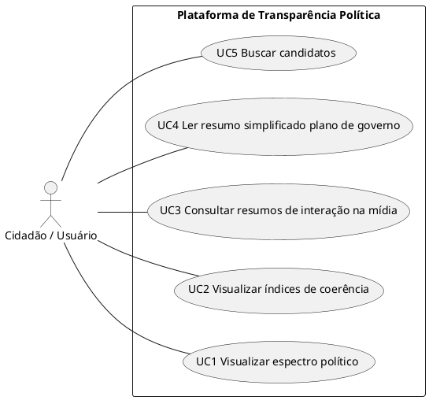

# Diagrama de Casos de Uso

---

# Descrição casos de uso

### UC4 - Analisar plano de governo do candidato (Fluxo Principal):
- Atores: Cidadão Brasileiro
- Sumário: O sistema fornece as infomações do plano de governo do candidato escolhido, de forma resumida e amigável ao usuário, para que ele possa checar o plano e comparar seus comportamentos.
- Pré-Condição: O usuário deve ter selecionado um candidato.
- Pós-Condição: O usuário tem acesso às informações recolhidas sobre o candidato

| Atividades do Usuário | Ações do Sistema |
|-----------------------|------------------|
| 1. Na página do candidato, o usuário seleciona a seção "Resumo do plano de governo". | |
| | 2. O sistema exibe os principais tópicos discutidos no plano de governo, junto com as ideias principais desses tópicos. Também mostra os tópicos menos discutidos. |

### UC1 - Visualizar Espectro Político:
- Atores: Cidadão Brasileiros.
- Sumário: O sistema identifica e posiciona o candidato em um mapa ideológico para contextualizar suas propostas.
- Pré-Condição: O usuário deve ter selecionado um candidato.
- Pós-Condição: O usuário visualiza a inclinação política do candidato.

| Ações do Ator | Ações do Sistema |
|----------------|------------------|
| 1. O Usuário visualiza o card ou o cabeçalho do perfil do candidato. | |
| | 2. O Sistema identifica o posicionamento ideológico com base no partido e histórico. |
| 3. O Usuário clica no ícone de "Espectro Político". | |
| | 4. O Sistema exibe um gráfico visual (mapa) indicando onde o candidato se situa (Ex: Centro-Esquerda, Direita, etc.). |

### UC2 - Visualizar índices de coerência:
- Atores: Cidadão Brasileiro
- Sumário: O sistema apresenta o índice de fidelidade do candidato comparando o plano de governo com suas falas em vídeos e postagens.
- Pré-Condição: O usuário deve ter selecionado um candidato.
- Pós-Condição: O usuário visualiza a porcentagem de fidelidade do candidato às suas promessas.

| Ações do Ator | Ações do Sistema |
|----------------|------------------|
| 1. Na página do candidato, o Usuário clica na seção "Análise de Coerência". | |
| | 2. O Sistema exibe o Índice de Coerência Geral (%) baseado no confronto entre mídias e plano. |
| 3. O Usuário solicita o detalhamento por temas. | |
| | 4. O Sistema exibe gráficos comparativos e o índice de fidelidade por tópico (ex: fidelidade em Economia). |

### UC3 - Consultar Resumos de Interação na Mídia:
- Atores: Cidadão Brasileiro
- Sumário: O sistema consolida o comportamento público do candidato em vídeos externos e redes sociais através de resumos textuais.
- Pré-Condição: O usuário deve ter selecionado um candidato.
- Pós-Condição: O usuário visualiza o panorama consolidado do comportamento público do candidato.

| Ações do Ator | Ações do Sistema |
|----------------|------------------|
| 1. Na página do candidato, o usuário acessa a seção "Atividade Pública". | |
| | 2. O Sistema exibe a lista de vídeos externos (debates/podcasts) e postagens sociais coletadas. |
| 3. O Usuário clica em "Ver Resumo" de um vídeo ou conjunto de posts. | |
| | 4. O Sistema apresenta a síntese textual das ideias principais defendidas pelo candidato naquelas mídias. |

### UC5 - Buscar Candidatos:
- Atores: Cidadão Brasileiro
- Sumário: O sistema permite filtrar e listar candidatos de uma eleição específica para que o usuário possa escolher um perfil para análise.
- Pré-Condição:Nenhuma.
- Pós-Condição: O sistema exibe os candidatos que correspondem aos critérios de busca.

| Ações do Ator | Ações do Sistema |
|----------------|------------------|
| 1. O Usuário acessa a página inicial. | |
| | 2. O Sistema exibe filtros de seleção (Ano da Eleição, Cargo). |
| 3. O Usuário seleciona o "Ano X" e clica em buscar. | |
| | 4. O Sistema busca na base de dados e lista os candidatos em cards visuais. |
| 5. O Usuário clica no card de um candidato específico. | |
| | 6. O Sistema redireciona para a página de perfil detalhado do candidato escolhido. |

---
## Codificação do Diagrama

