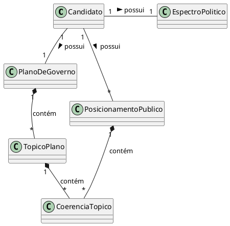

# Diagrama de Classes de Negócios

---
## Codificação do Diagrama

```plantuml
@startuml

skinparam nodesep 50
skinparam ranksep 50

class Candidato
class PlanoDeGoverno
class TopicoPlano
class PosicionamentoPublico
class EspectroPolitico
class CoerenciaTopico

Candidato "1" -right- "1" EspectroPolitico : possui >
Candidato "1" -- "1" PlanoDeGoverno : possui >
Candidato "1" -- "*" PosicionamentoPublico : possui >

PlanoDeGoverno "1" *-- "*" TopicoPlano : contém

TopicoPlano "1" *-- "*" CoerenciaTopico : contém
PosicionamentoPublico "1" *-- "*" CoerenciaTopico : contém

@enduml
```
