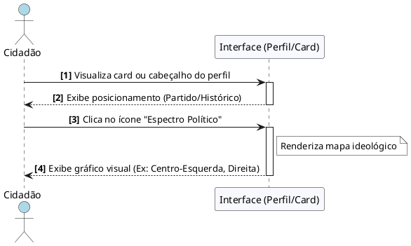

# Visualizar Espectro Político

---
## Descrição do Diagrama

O processo começa com o Cidadão acessando a página inicial da plataforma, onde a Interface disponibiliza filtros para refinar a pesquisa (como Ano da Eleição e Cargo). Ao definir os parâmetros e clicar em buscar, o sistema processa a solicitação e retorna uma galeria de cards visuais com os candidatos correspondentes. Por fim, o usuário seleciona o candidato desejado clicando em seu card, sendo então redirecionado para o perfil detalhado com as informações completas.

---
## Codificação do Diagrama

