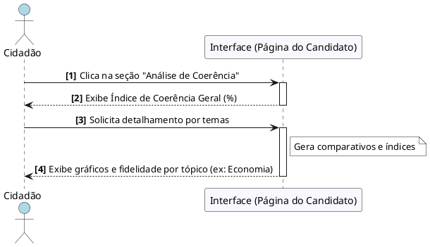

# Visualizar Índices de Coerência

---

## Descrição do Diagrama

O processo de análise de fidelidade tem início quando o Cidadão, já na página de um candidato específico, seleciona a seção "Análise de Coerência". A Interface processa a solicitação e apresenta de imediato o Índice de Coerência Geral, representado por uma porcentagem que reflete o alinhamento global entre o discurso público e as promessas oficiais.

Para uma investigação mais aprofundada, o usuário solicita o detalhamento por temas. Nesse momento, o sistema processa os dados comparativos e gera visualizações específicas para cada área (como Saúde, Educação ou Economia). O fluxo se encerra com a exibição de gráficos de fidelidade por tópico, permitindo que o cidadão identifique em quais assuntos o candidato mantém maior ou menor consistência em relação ao seu plano de governo.

---

## Codificação do Diagrama

