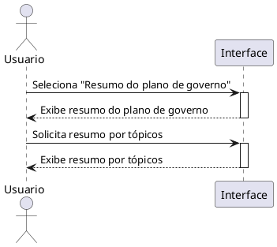

# Visualizar Resumo do Plano de Governo

---
## Descrição do Diagrama

Este diagrama de sequência ilustra o fluxo de interação entre um usuário e uma interface para consulta de dados políticos. O processo foca na experiência de navegação, onde o usuário solicita primeiro uma visão geral do plano de governo e, logo em seguida, opta por uma visualização mais organizada e segmentada por tópicos, destacando a capacidade do sistema de entregar informações de forma direta e estruturada.

---
## Codificação do Diagrama

