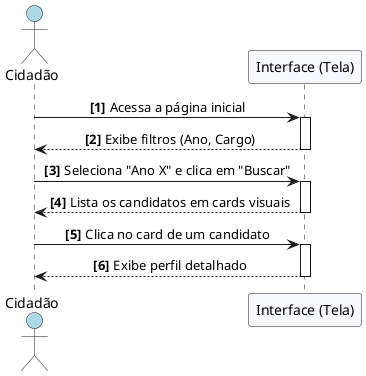

# Buscar Candidatos

---

## Descrição do Diagramma

O processo de navegação tem início quando o Cidadão acessa a Página Inicial da plataforma. A Interface disponibiliza de imediato os filtros de contexto, como o Ano da Eleição e o Cargo desejado, para que a pesquisa seja precisa.

Ao definir os parâmetros (como o "Ano X") e acionar a busca, o sistema processa a solicitação e retorna uma galeria organizada de cards visuais, contendo as informações rápidas de cada candidato (foto, nome e partido). O fluxo se encerra quando o usuário seleciona um candidato específico ao clicar em seu card, sendo então redirecionado pela interface para o Perfil Detalhado, onde terá acesso às análises de plano de governo e índices de coerência.

---

## Codificação do Diagrama

