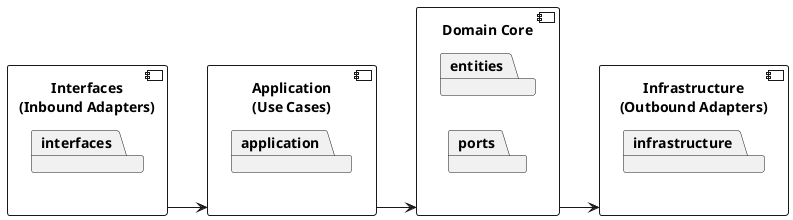

# Diagrama de Componente

---
## Diagrama de Componentes

O diagrama de componentes mostra **os grandes módulos do sistema** e como os pacotes estão organizados dentro deles:

- **View** – contém o pacote `view` 
- **Interfaces (Inbound Adapters)** – contém o pacote `interfaces`.  
- **Application (Use Cases)** – contém o pacote `application`.  
- **Domain Core** – contém os pacotes `entities` e `ports`, representando o núcleo do domínio.  
- **Infrastructure (Outbound Adapters)** – contém o pacote `infrastructure`, implementando as portas definidas no domínio.

---

## Codificação do Diagrama
