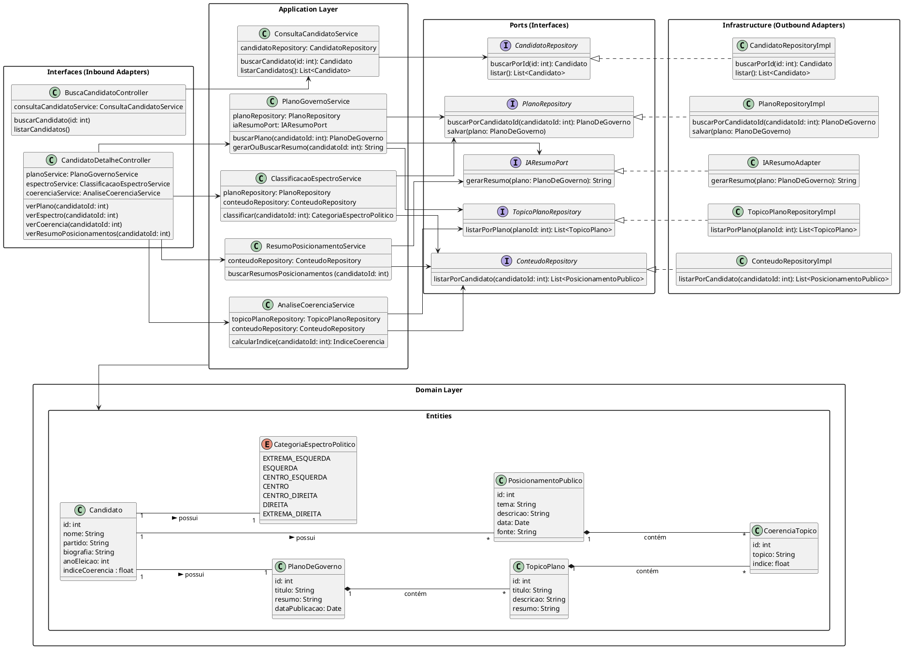

# Diagrama de Classe de Implementação

![](https://www.plantuml.com/plantuml/png/jLVTQXmt5BxNKnnyqtKWWTukmMIxkvI1jDwkNUXTa3NQjOX66YIDmQI-xGFqBVeSVPC-IJNAx95MbYQkeOHWp_dvpdT-vipn1-keSKCdYVqiL4yDxQ2dx3CzyXltA3aOpXnLHyaJ0oaKTuyz1stSlIQI7nmu3KOSxnsqOdGHMX529YIuQ9JZva0Pjx1er9qUL0khblPUQYylu0iXJ59huOV1ChgcgXKjTNgjbJDQIcwy1J2jx21TLDzmyo0ONyAweY44xaP0Wug5Q9SWbBia88LrYSOkBidJYGPADznHUS_FYVIIgXXyDpxzg1-uGI41RdlEd4aeZhZY81XbL6_FjMDgt73514NxbQAU85-Z0ZFoWKB81JkHR30dhvkmQse4hEZtt0wTtcahcD2ATbmvRGkslbHFINzNVIy5esFRuIDzv2RsjDgTiPG8lEUzZ-cqUVIrUYwSwMHYNshg4ZvwsNiKNM6NIvt3zgPyTkS20eAUocJS4ffLV4AUbHPDO1i-XILmv8QQwo4C_bJzajkDCq8TaNjXFf2_qxrWUfTdSLiIXxVAyQ4zRy0p6HbR9TaWgMayDyPB78CcKaAozU6lLlprB36KAL5SKyUFsWXwOh7JKZZ1T2HRUWEGwukPG1W4RAdDtYZuzYkrqHqLwTk4cgrodZEtGPejh97Yz6OGKBhZE3hGK-D4gwFWJkYZeGT1euWglPLSCAed277UKrZ2GMhgi5pPF9-5Ty8DCebdGYdYi-TBTyFTk3X2m0rrF0B7UPr7RRbbnaFK0o7aUHE-Xix0UKThqCXvOWg7iUtFes2nGWOPVX2XprJUfAXS3LrrIWFMzhVR_VQdrQVjpI-_RlUR5O7usthxy-t--bCkGCMcsM-RMo-VVa4qr3o5Vt7MngNcfnM_tzFNMfoUIyiQlk0MrAPfvpPrPJz7-D3_2ZJwDErBDgsbyi573CicrrwUHyNPos87rY5sq0KiZ3Xb4dtpN71Db24n7KmcXoxERnOa_HgDyE7xybLKIJsTuBJrZJeOQfqPc1iCXyNruAg7MsaCcgwNdW1yUnPWVXhYeidH_yTXo9TG5leLiu2WE0TLnDUE0iR0CPXwzPy7OVp_7PnEzN_--1EI4u-Gwft-zktLp3bUlglHiNHApxlCtzNpljKRUzvjxa3mDKlh5EeMDYWXjQ84oEB5MwX6h58qhDgbcw1gLBuAIQKqTPTPZzAbLcbSFSswGprAkLMlTychElOxz3Tq-dnX4bBwDBx__Tsxsh8CJSgDItkFv2s8vlMDHR9aqQEyZaYQQ33CTygO_7Ia6Yx3mDjxqTiaSRZu_i9NBVoe7pLBy87j8E2gw9cjgNdpDnVbAo_r8XdWwFjcSawlpcKuzl_-goEnu9bvVkj5bpABb_dwoeQp7_PJNO6K_i9-E_H-8EEV0-G3L-tGoNy1)
---
### Descrição 

O sistema é organizado em camadas:

#### 1. Interfaces (Inbound Adapters)

  - Controllers expõem endpoints para busca de candidatos e detalhes de seus planos, espectro político e coerência.

  - Exemplo: BuscaCandidatoController delega chamadas para ConsultaCandidatoService.

#### 2. Application Layer

  - Contém services que implementam a lógica de aplicação, coordenando a comunicação entre os repositórios, adaptadores e entidades de domínio.

  - Exemplo: PlanoGovernoService busca planos e gera resumos via IA (IAResumoPort).

#### 3. Domain Layer

  - Define as entidades centrais (Candidato, PlanoDeGoverno, TopicoPlano, etc.) e enums (CategoriaEspectroPolitico), representando o núcleo do negócio.

  - As entidades mantêm relacionamentos importantes, como cada candidato possuindo um plano de governo, índice de coerência e categoria política.

#### 4. Ports (Interfaces)

  - Interfaces que abstraem dependências externas, como repositórios de dados e adaptadores de IA.

  - Permitem que a Application Layer não dependa diretamente da implementação de infraestrutura.

#### 5. Infrastructure (Outbound Adapters)

  - Implementações concretas das interfaces de portas (RepositoryImpl, IAResumoAdapter) que interagem com bancos de dados ou serviços externos.

---

## Codificação do Diagrama

