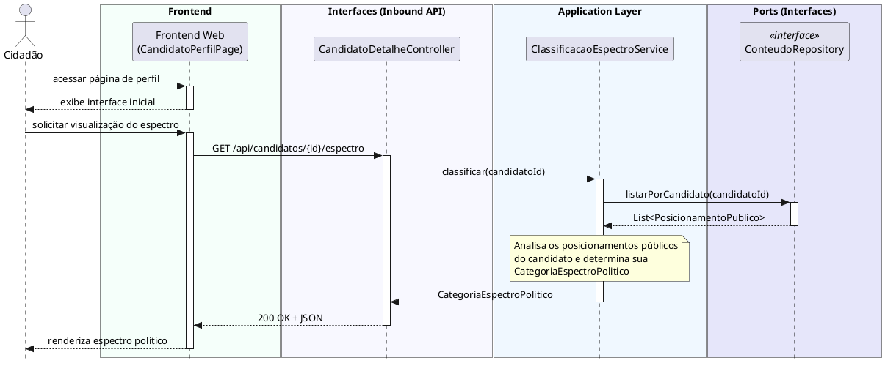

# Visualizar Espectro Político

---
## Codificação do Diagrama

```plantuml
@startuml
skinparam style strictuml
skinparam sequenceMessageAlign center
skinparam ParticipantPadding 40

actor "Cidadão" as User

box "Frontend" #MintCream
participant "Frontend Web\n(CandidatoPerfilPage)" as Front
end box

box "Interfaces (Inbound API)" #GhostWhite
participant "CandidatoDetalheController" as Ctrl
end box

box "Application Layer" #AliceBlue
participant "ClassificacaoEspectroService" as Service
end box

box "Ports (Interfaces)" #Lavender
participant "ConteudoRepository" as Repo <<interface>>
end box

' --- Carregamento inicial da página ---
User -> Front : acessar página de perfil
activate Front
Front --> User : exibe interface inicial
deactivate Front

' --- Requisição de dados do espectro ---
User -> Front : solicitar visualização do espectro
activate Front

Front -> Ctrl : GET /api/candidatos/{id}/espectro
activate Ctrl

Ctrl -> Service : classificar(candidatoId)
activate Service

Service -> Repo : listarPorCandidato(candidatoId)
activate Repo

Repo --> Service : List<PosicionamentoPublico>
deactivate Repo

note over Service
Analisa os posicionamentos públicos
do candidato e determina sua
CategoriaEspectroPolitico
end note

Service --> Ctrl : CategoriaEspectroPolitico
deactivate Service

Ctrl --> Front : 200 OK + JSON
deactivate Ctrl

Front --> User : renderiza espectro político
deactivate Front

@enduml
```
