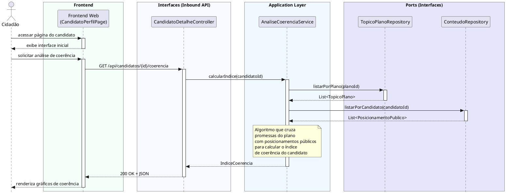

# Visualizar Índices de Coerência

---
## Codificação do Diagrama

```plantuml
@startuml
skinparam style strictuml
skinparam sequenceMessageAlign center
skinparam ParticipantPadding 40
skinparam ParticipantMinWidth 140
skinparam BoxPadding 20

actor "Cidadão" as User

box "Frontend" #MintCream
participant "Frontend Web\n(CandidatoPerfilPage)" as Front
end box

box "Interfaces (Inbound API)" #GhostWhite
participant "CandidatoDetalheController" as Ctrl
end box

box "Application Layer" #AliceBlue
participant "AnaliseCoerenciaService" as Service
end box

box "Ports (Interfaces)" #Lavender
participant "TopicoPlanoRepository" as RepoTopico
participant "ConteudoRepository" as RepoConteudo
end box

' --- Carregamento inicial da página ---
User -> Front : acessar página do candidato
activate Front
Front --> User : exibe interface inicial
deactivate Front

' --- Requisição dos dados de coerência ---
User -> Front : solicitar análise de coerência
activate Front

Front -> Ctrl : GET /api/candidatos/{id}/coerencia
activate Ctrl

Ctrl -> Service : calcularIndice(candidatoId)
activate Service

Service -> RepoTopico : listarPorPlano(planoId)
activate RepoTopico
RepoTopico --> Service : List<TopicoPlano>
deactivate RepoTopico

Service -> RepoConteudo : listarPorCandidato(candidatoId)
activate RepoConteudo
RepoConteudo --> Service : List<PosicionamentoPublico>
deactivate RepoConteudo

note over Service
Algoritmo que cruza
promessas do plano
com posicionamentos públicos
para calcular o índice
de coerência do candidato
end note

Service --> Ctrl : IndiceCoerencia
deactivate Service

Ctrl --> Front : 200 OK + JSON
deactivate Ctrl

Front --> User : renderiza gráficos de coerência
deactivate Front

@enduml
```
