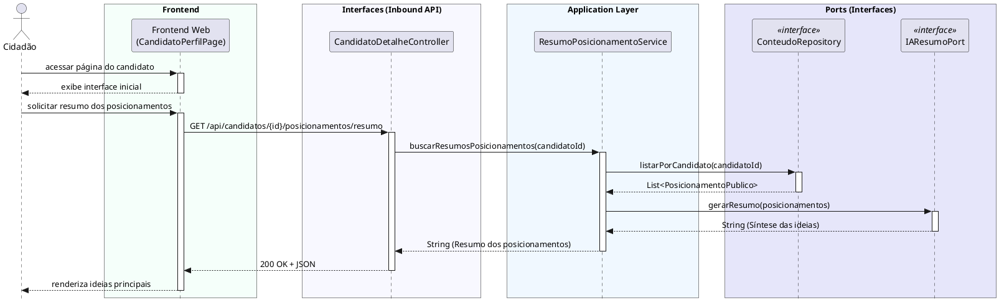

# Consultar Resumos de Interação na Mídia

---
## Codificação do Diagrama

```plantuml
@startuml
skinparam style strictuml
skinparam sequenceMessageAlign center
skinparam ParticipantPadding 40
skinparam ParticipantMinWidth 140
skinparam BoxPadding 20

actor "Cidadão" as User

box "Frontend" #MintCream
participant "Frontend Web\n(CandidatoPerfilPage)" as Front
end box

box "Interfaces (Inbound API)" #GhostWhite
participant "CandidatoDetalheController" as Ctrl
end box

box "Application Layer" #AliceBlue
participant "ResumoPosicionamentoService" as Service
end box

box "Ports (Interfaces)" #Lavender
participant "ConteudoRepository" as Repo <<interface>>
participant "IAResumoPort" as IA <<interface>>
end box

' --- Carregamento inicial da página ---
User -> Front : acessar página do candidato
activate Front
Front --> User : exibe interface inicial
deactivate Front

' --- Requisição dos resumos de posicionamento ---
User -> Front : solicitar resumo dos posicionamentos
activate Front

Front -> Ctrl : GET /api/candidatos/{id}/posicionamentos/resumo
activate Ctrl

Ctrl -> Service : buscarResumosPosicionamentos(candidatoId)
activate Service

Service -> Repo : listarPorCandidato(candidatoId)
activate Repo
Repo --> Service : List<PosicionamentoPublico>
deactivate Repo

Service -> IA : gerarResumo(posicionamentos)
activate IA
IA --> Service : String (Síntese das ideias)
deactivate IA

Service --> Ctrl : String (Resumo dos posicionamentos)
deactivate Service

Ctrl --> Front : 200 OK + JSON
deactivate Ctrl

Front --> User : renderiza ideias principais
deactivate Front

@enduml
```
