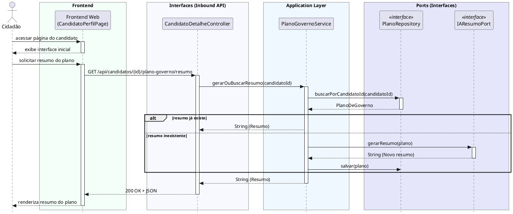

# Visualizar Resumo de Plano de Governo

---
## Codificação do Diagrama

```plantuml
@startuml
skinparam style strictuml
skinparam sequenceMessageAlign center
skinparam ParticipantPadding 40
skinparam ParticipantMinWidth 140
skinparam BoxPadding 20

actor "Cidadão" as User

box "Frontend" #MintCream
participant "Frontend Web\n(CandidatoPerfilPage)" as Front
end box

box "Interfaces (Inbound API)" #GhostWhite
participant "CandidatoDetalheController" as Ctrl
end box

box "Application Layer" #AliceBlue
participant "PlanoGovernoService" as Service
end box

box "Ports (Interfaces)" #Lavender
participant "PlanoRepository" as Repo <<interface>>
participant "IAResumoPort" as IA <<interface>>
end box

' --- Carregamento inicial da página ---
User -> Front : acessar página do candidato
activate Front
Front --> User : exibe interface inicial
deactivate Front

' --- Requisição do resumo do plano de governo ---
User -> Front : solicitar resumo do plano
activate Front

Front -> Ctrl : GET /api/candidatos/{id}/plano-governo/resumo
activate Ctrl

Ctrl -> Service : gerarOuBuscarResumo(candidatoId)
activate Service

Service -> Repo : buscarPorCandidatoId(candidatoId)
activate Repo
Repo --> Service : PlanoDeGoverno
deactivate Repo

alt resumo já existe
    Service --> Ctrl : String (Resumo)
else resumo inexistente
    Service -> IA : gerarResumo(plano)
    activate IA
    IA --> Service : String (Novo resumo)
    deactivate IA

    Service -> Repo : salvar(plano)
end

Service --> Ctrl : String (Resumo)
deactivate Service

Ctrl --> Front : 200 OK + JSON
deactivate Ctrl

Front --> User : renderiza resumo do plano
deactivate Front

@enduml
```
