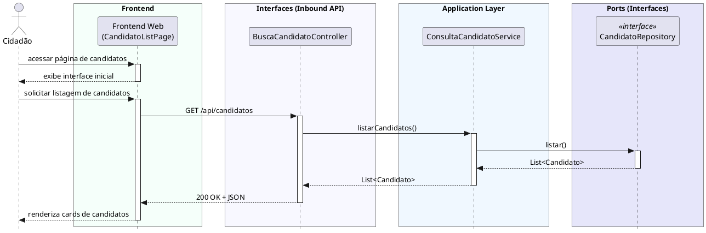

# Buscar Candidatos

---
## Codificação do Diagrama

```plantuml
@startuml
skinparam style strictuml
skinparam sequenceMessageAlign center
skinparam ParticipantPadding 40
skinparam ParticipantMinWidth 140
skinparam BoxPadding 20

actor "Cidadão" as User

box "Frontend" #MintCream
participant "Frontend Web\n(CandidatoListPage)" as Front
end box

box "Interfaces (Inbound API)" #GhostWhite
participant "BuscaCandidatoController" as Ctrl
end box

box "Application Layer" #AliceBlue
participant "ConsultaCandidatoService" as Service
end box

box "Ports (Interfaces)" #Lavender
participant "CandidatoRepository" as Repo <<interface>>
end box

' --- Carregamento inicial da página ---
User -> Front : acessar página de candidatos
activate Front
Front --> User : exibe interface inicial
deactivate Front

' --- Requisição da lista de candidatos ---
User -> Front : solicitar listagem de candidatos
activate Front

Front -> Ctrl : GET /api/candidatos
activate Ctrl

Ctrl -> Service : listarCandidatos()
activate Service

Service -> Repo : listar()
activate Repo
Repo --> Service : List<Candidato>
deactivate Repo

Service --> Ctrl : List<Candidato>
deactivate Service

Ctrl --> Front : 200 OK + JSON
deactivate Ctrl

Front --> User : renderiza cards de candidatos
deactivate Front

@enduml
```
